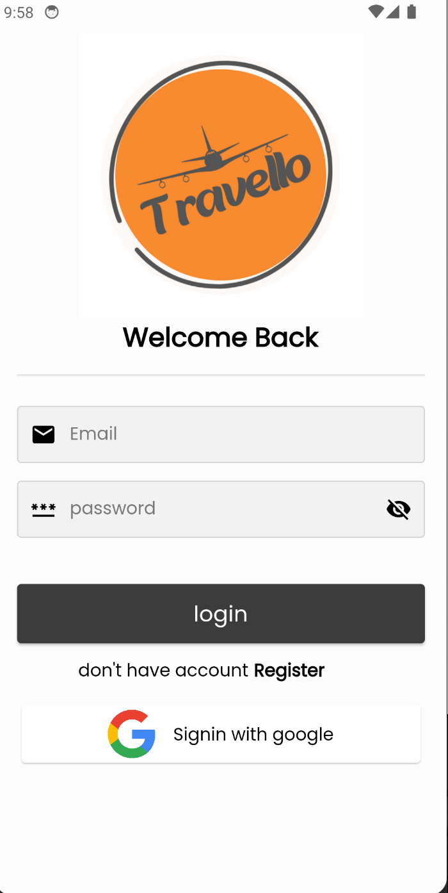
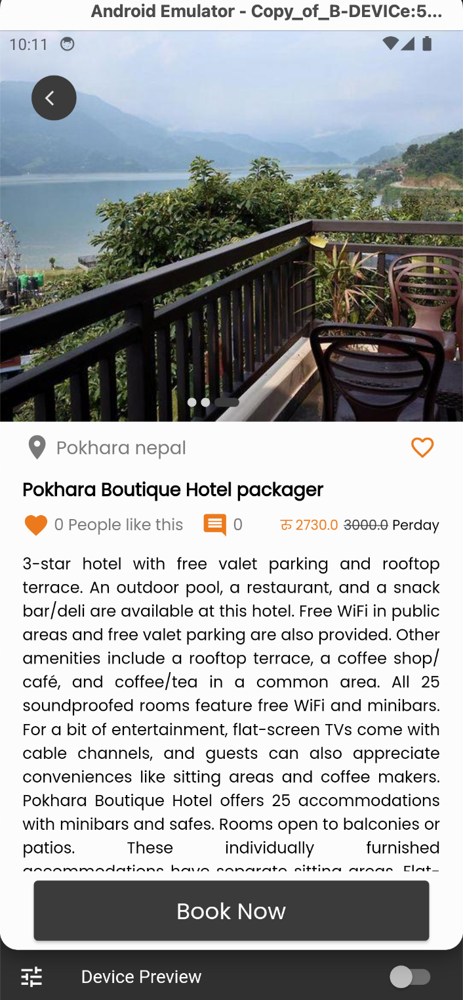

# 🌍 **Travello - Travel Management System** 🧳

**Travello** is a **travel management system** built with **Flutter**, offering a seamless experience for clients and admins. Firebase powers its **authentication**, **real-time data**, and **secure storage**.

---

### 🛠️ **Project Structure**

- **t_client**: A mobile app for clients to manage bookings, view itineraries, and get real-time updates.
- **t_admin**: A web app for admins to manage bookings, client data, and content.

---

## ✨ **Travello Features**

### 🚶 **End-user (Traveler) Features**
The **t_client** mobile app offers:

- 🛡️ **Sign In/Register**: Secure authentication.
- 🗺️ **Browse Travel Packages**: View and search for travel deals.
- 📅 **Place Bookings**: Reserve travel packages effortlessly.
- 🚀 **Track Orders**: Stay updated on booking status.
- 💬 **Chat with Admin**: Get support in real-time.
- ❤️ **Save Favorites**: Bookmark favorite packages.
- ❌ **Cancel Bookings**: Easy booking cancellations.
- 💳 **Payments**: Secure Khalti payment gateway integration.
- 📍 **Nearest Destinations Map**: Explore nearby locations interactively.
- 🌅 **360 Panoramic View**: Immerse in destinations through a 360° experience.

---

### 📋 **Admin Features**
The **t_admin** web app offers:

- 🔐 **Sign In**: Secure admin authentication.
- 👥 **User & Booking Management**: Manage client accounts and reservations.
- ✏️ **CRUD Travel Packages**: Create, read, update, and delete travel deals.
- 📌 **Manage Booking Status**: Update and cancel reservations.
- 🗨️ **Chat with Clients**: Direct communication for support.

---

## ⚙️ **Tools & Technologies**

- **Flutter** 
- **Firebase**: Authentication, Firestore, Storage 
- **Khalti Payment Gateway** 
- **Open Street Maps & Geolocation** 

---

## 🧱 **Project Architecture**
The architecture is divided into four main layers:

1. **Data**  
   Responsible for managing data-related logic such as API calls and database operations.
   
2. **Domain**  
   Contains business logic, use cases, and entity models, ensuring separation from data sources.

3. **Presentation**  
   Handles UI components and state management.

4. **Core**  
   Holds reusable components and global configurations used across the app.

---

# 🛠️ **SOLID Principles in Flutter**

 This project adheres to the **SOLID principles** through a well-structured layered architecture. Each layer has a specific responsibility, and the core folder encapsulates reusable components and global utilities, ensuring scalability, maintainability, and testability.

---

# 🔄 **SOLID Principle Breakdown**

## 🛠️ Single Responsibility Principle (SRP)  
Each class has a single, well-defined responsibility.  
**Example**:  
`AuthRepo` handles only Authentication.

---

## 🛠️ Open/Closed Principle (OCP)  
Classes are open for extension but closed for modification.  
**Example**:  
Adding a new API endpoint without modifying existing code by creating a new method in `ApiClient`.

---

## 🛠️ Liskov Substitution Principle (LSP)  
Subtypes must be substitutable for their base types.  
**Example**:  
`UserRepositoryImpl` seamlessly replaces `UserRepository`.

---

## 🛠️ Interface Segregation Principle (ISP)  
Interfaces are small and specific to client needs.  
**Example**:  
Separate interfaces for `UserRepository` and `ProductRepository`.

---

## 🛠️ Dependency Inversion Principle (DIP)  
High-level modules depend on abstractions, not concrete implementations.  
**Example**:  
`UserBloc` depends on the abstract `UserRepository` rather than `UserRepositoryImpl`.


## Folder Structure 
```
lib/
├── core/
│   ├── widgets/
│   ├── utils/
│   ├── constants.dart
│   ├── theme.dart
│
├── data/
│   ├── repositories/
│   ├── sources/
│   ├── models/
│
├── domain/
│   ├── entities/
│   ├── usecases/
│
├── presentation/
│   ├── screens/
│   ├── blocs/
│   ├── widgets/

```

## Getting Started

1. **Flutter SDK**
 Ensure you have Flutter SDK version `>=3.0.5` installed. [Install Flutter](https://flutter.dev/docs/get-started/install) if not already set up.
2. **FlutterFire CLI**
 Install the FlutterFire CLI, which simplifies Firebase configuration for Flutter projects:
   ```bash
   dart pub global activate flutterfire_cli
   ```
3. **Clone the Repository**: Clone this repository to your local machine
    ```bash
    git clone https://github.com/Sushil787/Single-Vendor-Travel.git
    cd travel_management_system/apps
    ```
    Since the project includes both a client app and an admin web app, you need to configure Firebase for both parts of the application.
    ```bash
    cd t_admin or cd t_client
    ```
  
4. **Install Dependencies**
 Install all project dependencies using the following command:
    ```bash
    flutter pub get
      ```
5. **Configure Firebase with FlutterFire CLI**
    ```bash
    flutterfire configure
    ```
    The FlutterFire CLI will generate a firebase_options.dart file with your Firebase configuration. Make sure this file is imported in your main.dart file for Firebase initialization.
6. **Generate Code with build_runner**
    The project uses generated models, Bloc state and event classes for state management. Run the following command to generate necessary files:
    ```bash
    flutter pub run build_runner build --delete-conflicting-outputs
    ```
    This will generate:
    - Models for data management and serialization.
    - State Classes and Bloc Files for managing app state and events. 
    Note: Run this command every time you make changes to models, state, or event classes.

7. **Run the App**
    After configuring Firebase and generating the necessary files, you can now run the app:
    ```bash
    flutter run
    ```


## Important Packages

### State Management
- **flutter_bloc**: Used for managing the app's state across different components, ensuring clear state transitions and predictable behaviors.
- **get_it**: Acts as a service locator for dependency injection, helping to manage and retrieve services and data classes from anywhere in the app.

### Payment Integration
- **khalti_flutter**: Used for secure payment processing, allowing users to complete transactions directly in the app. Khalti integration ensures a smooth and secure transaction process, providing a trusted payment gateway for users to make online payments for bookings and other services.


### Firebase Integration
- **firebase_auth**: Manages user authentication, enabling sign-in and sign-out flows using Firebase's secure authentication methods.
- **cloud_firestore**: Used for real-time data storage and syncing, allowing users to access data such as bookings, itineraries, and user profiles.
- **firebase_storage**: Stores user-uploaded files, such as profile images or travel documents, securely on Firebase’s cloud storage.
- **firebase_messaging**: Enables push notifications, allowing real-time updates to be sent to users for bookings, offers, and other relevant alerts.

### Location & Mapping
- **geolocator**: Provides real-time location tracking for users, assisting in calculating travel distances or nearby landmarks.
- **latlong2**: Handles geographic location data, crucial for mapping functionalities and integrating with various geolocation-based services.
- **flutter_osm_plugin** and **flutter_map**: Used for integrating interactive maps within the app, allowing users to view locations and itineraries visually on a map.

### Data Persistence & Caching
- **hive** and **hive_flutter**: Provides lightweight, offline storage capabilities, which are ideal for storing small data sets like user preferences and session information.

### User Interface & Experience
- **google_fonts**: Allows for customizable fonts, enhancing the app’s design and readability.
- **shimmer**: Provides a shimmer loading effect, creating an engaging placeholder while data is being loaded.
- **panorama_viewer**: Allows users to explore panoramic images, enhancing user engagement with immersive visuals.

### Notifications & Updates
- **flutter_local_notifications**: Handles in-app notifications, allowing timely alerts for booking updates, travel reminders, and more.
- **in_app_update**: Facilitates in-app updates, ensuring users have the latest version of the app without leaving the application.

### Utility Packages
- **image_picker**: Lets users upload profile pictures or document images directly from their camera or gallery.
- **connectivity_plus**: Detects network connectivity, prompting users in case of offline access.
- **uuid**: Used for generating unique IDs, which are essential for data such as bookings or user sessions.

### Code Generation
- **json_serializable** and **json_annotation**: Automatically generate code for serializing and deserializing JSON data, simplifying data exchange between the app and backend.
- **freezed** and **freezed_annotation**: Provides immutable data classes and union types, essential for maintaining a clean data model.
- **injectable** and **injectable_generator**: Helps in dependency injection, making the app modular and testable.
- **build_runner**: A utility for code generation, used alongside `json_serializable`, and `freezed`.

## Additional Information
To run this project, ensure the required Firebase setup (Firebase Authentication, Firestore, and Firebase Storage) is configured, and dependencies are installed.


### Developer Note

- Adhere to coding standards and best practices established in the project.
- Thoroughly test new features and changes before integration.
- Regularly review and update documentation to reflect changes in the project.


## Screenshots 

#### Mobile App






#### Web App


